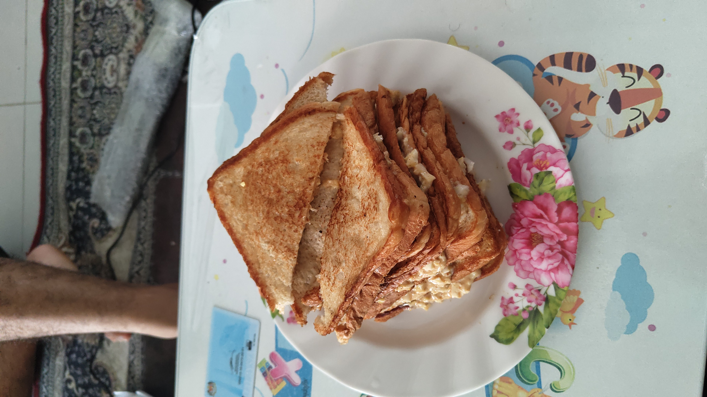

# Sandwich Telur
-   Dihasilkan dalam lab yang berteknologi tinggi, rnd formula selama 4 tahun dan menggunakan teknologi nano material terkini yang di proses kiraan logaritma dan algebra quantum mechanis oleh super computer dan dipantau hasil buatan nya oleh A.I., ini lah teknologi makanan yang uman manusia tak pernah lihat, kami gelarkan makanan ini sebagai sandwich telur.

## Version
- ```v1.0```

## Developer
- ```Jantan Technology Inc```

## Final Result
- Hasil akhir kejadian


## Raw Material
- Bahan-bahan mentah radio pasif


## Steps
1) Buka YouTube
2) Search ```Cara buat sandwich roti telur```